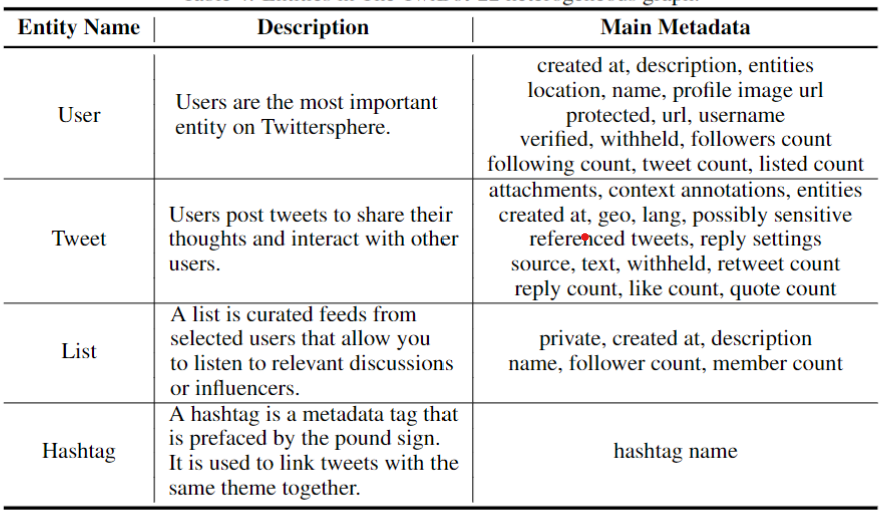
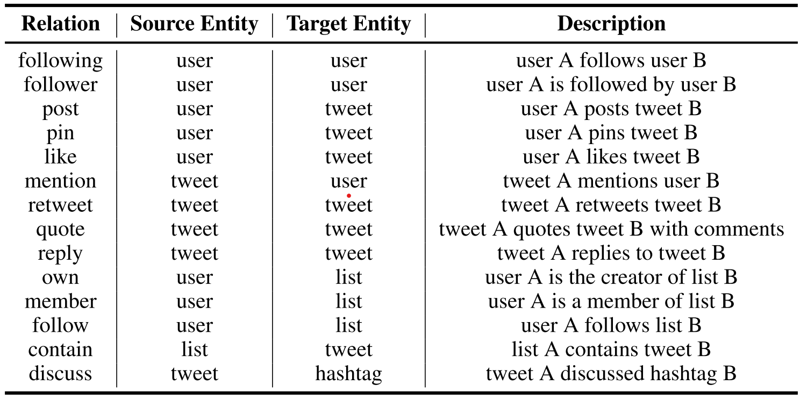
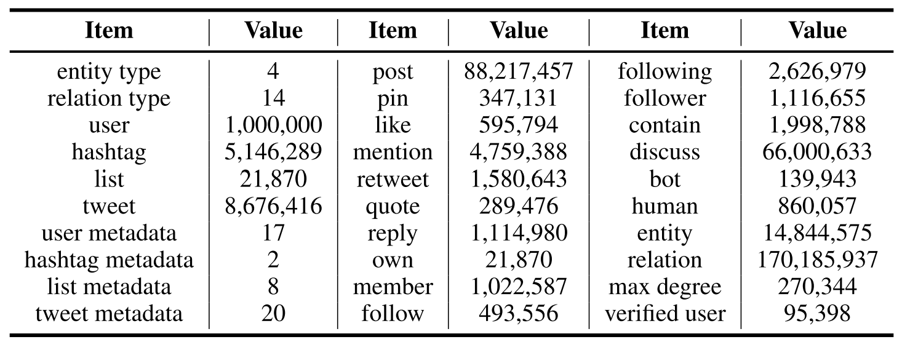

## Statistics of TwiBot-22

TwiBot-22 is the largest and most comprehensive Twitter bot detection benchmark to date. Specifically, [TwiBot-20](https://dl.acm.org/doi/pdf/10.1145/3459637.3482019) is designed to address the challenges of limited dataset scale, imcomplete graph structure, and low annotation quality in previous datasets. For more details, please refer to the [TwiBot-22 paper]() and [statistics](descriptions/statistics.md).

### Entity types

### Relation types

### Detailed statistics

### Comparing to other datasets

For more detailed information on sampling methods, labeling quality, etc., please refer to [TwiBot-22 paper]()